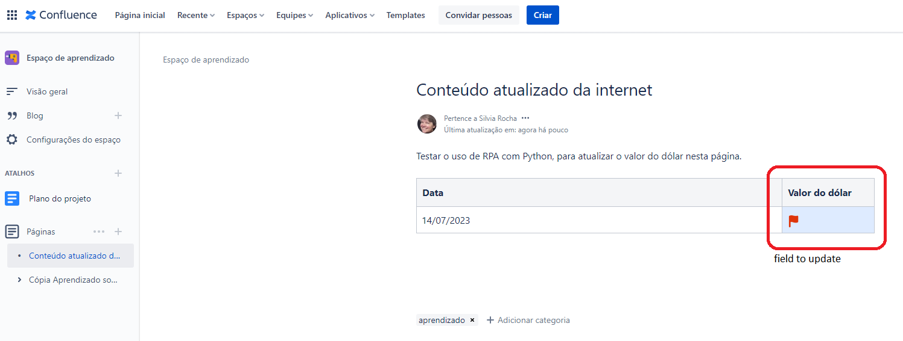

<h1>Using Python to automate a Confluence page</h1>
<h2>Objective</h2>
Update a page in Confluence, inserting the dolar value in brazilian real.
<h2>The page</h2>
Below is the page to be updated. The program assumes the user is loged on Confluence. 
 

 
<h2>Steps</h2>

* Uses the pyautogui library to automate the use of keybord and mouse (see: https://pyautogui.readthedocs.io/en/latest/);
* Uses the requests library to make a request to the API: https://docs.awesomeapi.com.br/api-de-moedas;
* Retrieves the value of dolar (in brazilian real) and update the selected field in a Confluence page;
* Publishes the page.

<h2>Execution</h2>

Below, a link to the recording of the screen while executing the program.

https://youtu.be/t0h4egu1j1Q

